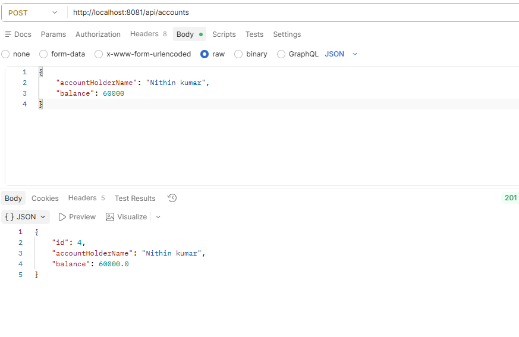

# 🏦 Banking Application

A RESTful Banking Application built with Spring Boot that provides account management, deposits, withdrawals, fund transfers, and transaction history tracking.

## 🚀 Features

- Create a new bank account
- Retrieve account details by ID
- View all accounts
- Deposit money into an account
- Withdraw money from an account
- Transfer funds between accounts
- Track transaction history
- Global exception handling
- Layered architecture using DTOs and Mappers

---

## 🛠️ Tech Stack

- Java 17+
- Spring Boot
- Spring Data JPA
- Hibernate
- MySQL
- Maven
- REST APIs

---

## 📂 Project Structure

```text
src/main/java/com/project/banking
│
├── controller
│   └── AccountController
│
├── dto
│   ├── AccountDto
│   ├── TransactionDto
│   └── TransferFundDto
│
├── Entity
│   ├── Account
│   └── Transaction
│
├── exception
│   ├── AccountException
│   ├── ErrorDetails
│   └── GlobalExceptionHandler
│
├── mapper
│   └── AccountMapper
│
├── Repository
│   ├── AccountRepository
│   └── TransactionRepository
│
├── service
│   ├── AccountService
│   └── impl
│       └── AccountServiceImpl
│
└── BankingApplication
```

---

## 📌 API Endpoints

### Create Account

```http
POST /api/accounts
```

**Request Body**

```json
{
  "accountHolderName": "John Doe",
  "balance": 1000
}
```

---

### Get Account By ID

```http
GET /api/accounts/{id}
```

---

### Get All Accounts

```http
GET /api/accounts
```

---

### Deposit Amount

```http
PUT /api/accounts/{id}/deposit
```

**Request Body**

```json
{
  "amount": 500
}
```

---

### Withdraw Amount

```http
PUT /api/accounts/{id}/withdraw
```

**Request Body**

```json
{
  "amount": 200
}
```

---

### Transfer Funds

```http
POST /api/accounts/transfer
```

**Request Body**

```json
{
  "fromAccountId": 1,
  "toAccountId": 2,
  "amount": 300
}
```

---

### Get Transaction History

```http
GET /api/accounts/{id}/transactions
```

---

### Delete Account

```http
DELETE /api/accounts/{id}
```

---

## 🔄 Transaction Types

The application automatically records transactions for:

- DEPOSIT
- WITHDRAW
- TRANSFER

Each transaction stores:

- Transaction ID
- Account ID
- Amount
- Transaction Type
- Timestamp

---

## ⚠️ Exception Handling

Custom exception handling is implemented using:

- `AccountException`
- `GlobalExceptionHandler`
- `ErrorDetails`

Examples:

- Account not found
- Insufficient balance
- Invalid requests

---

## 📸 API Screenshots

Store your Postman screenshots inside:

```text
screenshots/
```

Recommended screenshots:

```text
create-account.png
get-account-by-id.png
get-all-accounts.png
deposit-money.png
withdraw-money.png
transfer-funds.png
transaction-history.png
delete-account.png
```

Example:

```markdown
### Create Account


### Transfer Funds


### Transaction History

```

---

## ▶️ Running the Application

### Clone Repository

```bash
git clone https://github.com/your-username/banking-application.git
```

### Navigate to Project

```bash
cd banking-application
```

### Configure Database

Update `application.properties`:

```properties
spring.datasource.url=jdbc:mysql://localhost:3306/banking_db
spring.datasource.username=root
spring.datasource.password=your_password

spring.jpa.hibernate.ddl-auto=update
```

### Run Application

```bash
mvn spring-boot:run
```

Server starts at:

```text
http://localhost:8080
```

---

## 🎯 Learning Outcomes

This project demonstrates:

- Spring Boot REST API development
- Layered Architecture
- DTO Pattern
- Entity Mapping
- Exception Handling
- Database Integration using JPA/Hibernate
- Transaction Management Concepts

---

## 🔮 Future Enhancements

- JWT Authentication & Authorization
- Role-Based Access Control
- Swagger/OpenAPI Documentation
- Docker Support
- Unit & Integration Testing
- Account Statement Generation

---

## 👨‍💻 Author

**Sindhu**

Java | Spring Boot | Backend Developer

---

## ⭐ If You Like This Project

Give this repository a star and feel free to fork it for learning purposes.
